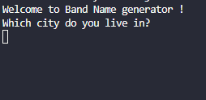
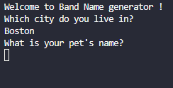
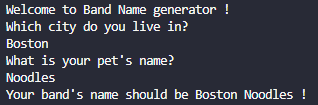

# Band-Name-Generator
A very simple python project made for #Day1 of #100DaysOfCode challenge.
## What Does This Do ?
So, first of all it will ask for the city in which you live.

Then, it will ask you for your pet's name.

Finally, it will suggest a name for your band based on the inputs you gave it.

## Final Words
So, this was my day 1. I learnt a lot and I had a lot of fun making it. I am very excited for the upcoming days. 
